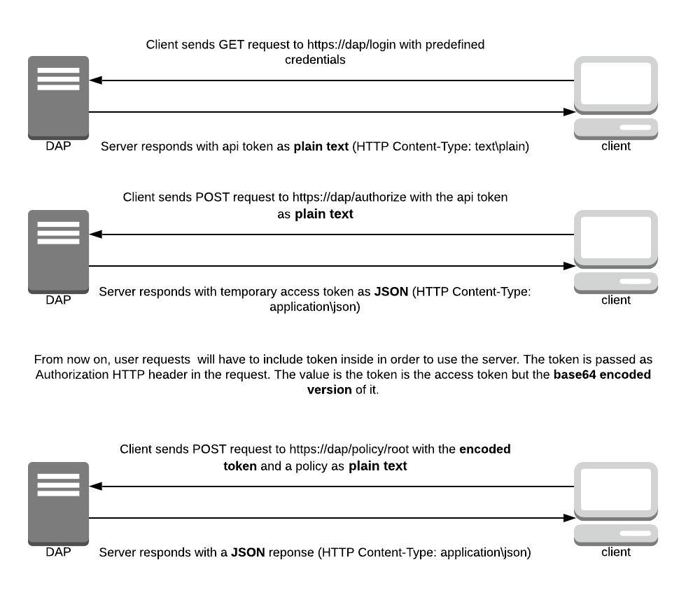

# Encoded Token Response - Solution Design

## Table of Contents
  * [Table of Contents](#table-of-contents)
  * [Glossary](#glossary)
  * [Useful links](#useful-links)
  * [Background](#background)
  * [Issue description](#issue-description)
  * [Solution - Accept HTTP Header](#solution---accept-http-header)
    + [Design](#design)
    + [Backwards compatibility](#backwards-compatibility)
  * [Solution - URL Patten](#solution---url-patten)
    + [Design](#design-1)
    + [Backwards compatibility](#backwards-compatibility-1)
  * [Preferred Solution](#preferred-solution)
  * [Security](#security)
  * [Test Plan](#test-plan)
  * [Documentation](#documentation)
  * [Open questions](#open-questions)

## Glossary

| **Term** | **Description** |
|----------|-----------------|
| encoded         | base64 encoded               |

## Useful links
1. [HTTP Content Negotiation Best Practices](https://restfulapi.net/content-negotiation/)
2. MDN web docs:
    1. [HTTP Accept Header](https://developer.mozilla.org/en-US/docs/Web/HTTP/Headers/Accept)
    2. [HTTP Accept-Encoding Header](https://developer.mozilla.org/en-US/docs/Web/HTTP/Headers/Accept-Encoding)
    3. [HTTP Content-Type Header](https://developer.mozilla.org/en-US/docs/Web/HTTP/Headers/Content-Type)
    4. [HTTP Content-Encoding Header](https://developer.mozilla.org/en-US/docs/Web/HTTP/Headers/Content-Encoding)
3. [Rails Routing Guides](https://guides.rubyonrails.org/routing.html#route-globbing-and-wildcard-segments)
4. [Correct Usage of JSON](https://stackoverflow.com/questions/477816/what-is-the-correct-json-content-type)

## Background
When a user connects to Conjur (via UI or CLI etc.), Conjur uses `authn` authenticator to perform the authentication.

The current situation is:



The response is a JSON like:
```json
{
    "protected": "eyJhbGciOiJjb25qdXIub3JnL3Nsb3NpbG8vdjIiLCJraWQiOiJjNjEyNTgwNzQ1YjkxMTBjNGQ5YjBkZWFkYTZkMGU0NjlmNDNkMjE5ZDIwZjdiMGM1YmNlMDVmYjE0MGYzNGM4In0=",
    "payload": "eyJzdWIiOiJhZG1pbiIsImlhdCI6MTU5NjEyNzg1N30=",
    "signature": "CZgBa6SwfumtC90QoIIh_vfeXgO_I1SfFYrl4RMiCrW_NtMPOoBIbV6WKze1_P6EjnGAsOHoZmEJ3g_7GpTAAuFU6arj2Ku4JDUup--jPTvfAcPxZViQBISTTmwLUXlDqPsIFbG9lfLV-cCM0v_6BbU0dgWba-w-k41PGHQupioSe_kr5b6izo9prSYlCpn_s9GZz41AYDPxiEPZHk-Xe2fjJCRt5vUI_QJKGA8pScMUozFIxXeGeH3nM28W54rqdRQoJxvgW7YUH_5x0nNurLgtJQSZHI38x9uTassLiRluj5AtkB6DCPCvRQiNdq2yyAQOZuVe7Cj8baHYDDrIpJNUjW2VeJ22f-vcGrsoB6X3H7Y2hfzBxw1NQjEaDaz5"
}
``` 

In order to work with the server the user **must** encode the response:
```sh
echo "Get Conjur access token using an Azure access token"
# Get an authn-azure Conjur access token for host azure-apps/test-app
authn_azure_response=$(curl -k -X POST \
  -H "Content-Type: application/x-www-form-urlencoded" \
  --data "jwt=$azure_access_token" \
  https://"$CONJUR_SERVER_DNS":8443/authn-azure/test/cucumber/host%2Fazure-apps%2Ftest-app/authenticate)
authn_azure_access_token=$(echo -n "$authn_azure_response" | base64 | tr -d '\r\n')

echo "Retrieve a secret using the Conjur access token"
# Retrieve a Conjur secret using the authn-azure Conjur access token
secret=$(curl -k -H "Authorization: Token token=\"$authn_azure_access_token\"" \
  https://"$CONJUR_SERVER_DNS":8443/secrets/cucumber/variable/secrets/test-variable)

echo "Retrieved secret ${secret} from Conjur!!!"
```
Taken from: https://github.com/cyberark/conjur/blob/application_identity_validation/ci/authn-azure/run-authn-azure.sh#L16


The required situation is to support both `application/json` response (as above) and encoded one.
The user will have the option to receive an encoded response which skips the encoding process afterwards. 

## Issue description
1. HTTP server best practices: Using `application\json` as the content type to encoded output (not a JSON) is bad practice.
    So encoded output shouldn't use `application/json` unless it will be in JSON format. 
    The `../autheticate` response is in JSON format so it makes sense to use `application\json` as the response content type.
        As well as `../logic`,  which returns the api key as `text\plain`.

## Solution - Accept HTTP Header
According to [MDN web docs](https://developer.mozilla.org/en-US/docs/Web/HTTP/Headers/Accept):
 > The `Accept` request HTTP header advertises which content types the client is able to understand. Using content negotiation, the server then selects one of the proposals, uses it and informs the client of its choice with the `Content-Type` response header.

To conclude, we can choose the response's `Content-Type` by the request's `Accept` header.

### Design
When `../authenticate` request the response will be encoded **only** if the `Accept` header is `text/plain`. 
Otherwise, returns decoded json access token as `application/json`.

```ruby
def authenticate
    # get the authn access token
    content_type = (request.headers["Accept"] == "text\plain") ? :text : :json
    # encode Base64 if needed
    render content_type => auth_token
```
### Backwards compatibility
Default behaviour: Only if the `Accept` is set to `text\plain` the response will be encoded.

## Solution - URL Patten
According to [Rails Routing Guides](https://guides.rubyonrails.org/routing.html#route-globbing-and-wildcard-segments)  we can use wildcards to suggests the requested `Content_type`.

By requesting `../authenticate.encoded` the output will be encoded access token.    

### Design
When `../authenticate` request the response will be encoded **only** if the url suffix (wildcard) is `.encoded`.
Otherwise, returns decoded json access token as `application/json`

```ruby
def authenticate
    # get the authn access token
    # extract the url suffix
    content_type = ( url_suffix == ".encoded") ? :text : :json
    # encode Base64 if needed
    render content_type => auth_token
```
### Backwards compatibility
Default behaviour: If the request doesn't include the `encoded` wildcard explicitly the response will be decoded.

## Preferred Solution
Even though, rails routing guidelines suggests that it supports response's content type based on wildcard suffix,
I prefer the `Accept` HTTP header solution. This solution is is more accurate from content negotiation point of view.
The suffix based solution is less complicated but it makes the request seems like it ask for a file (which ends with a 
certain suffix) rather than a dynamic content type handling. The `Accept` method is more like a contract between the client 
and server - in our case the client accepts `text\plain` response causes the server to send an encoded token. 

## Security
TBD

## Test Plan

| **Title** | **Given** | **When** | **Then** | **Comment** |
|-----------|-----------|----------|----------|-------------|
| Successful encoded token response           | Credentials          | I send an authenticate request          |  I get an encoded valid token        | Authenticate using the chosen method            |
| Failed authenticate request works          | Wrong credentials          | I send an authenticate request         | I get the same response as decode flow         |             |


## Documentation
- [ ] Add documentation about new API ability

## Open questions
* Conjur server profile - Should we define conventions about Conjur sessions (requests and response content types)?
* Audit/ Logs- Do we need to document successful encoded token requests in a special way?
* Add the `Accept-Encoding` validation (Solution 1)?
